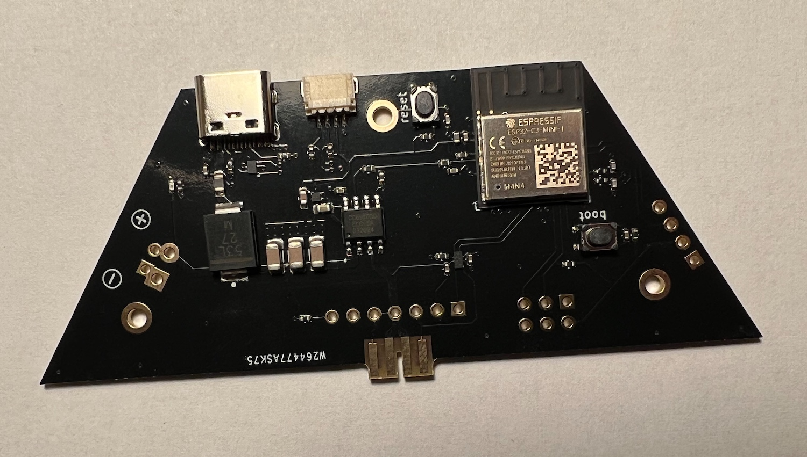

# Trixel Controller v1.0 Hardware

ESP32-C3 based controller board for trixel tiles.

Firmware for it can be found [here](https://github.com/runger1101001/led_driver_esp32).

More detailed explanation of how to use this controller can be found in the firmware documentation as well as the documentation for [the web ui](https://github.com/runger1101001/trixelcontroller-ui).

## Features

- ESP32-C3-MINI MCU
- 1 Trixel connector for board to board connections and as 1x7 header
- USB-C for power, serial debugging and programming
- Stemma/QT compatible I2C port
- Current sensing via hall effect current sensor
- Current levels up to 3A supported via USB, up to 5A via power header
- Buttons for Boot and Reset (not really needed with USB)
- Serial RX/TX routed to header for serial programming (don't know why since you have USB)
- 6 additional IOs routed to 2x3 header
- 5V power input header

## Using this project

This project was created in KiCad 6. You may need symbols/footprints from [my KiCad library](https://github.com/runger1101001/kicad-lib-runger).

Making the controller board should not be difficult. It is a fairly simple 4 layer board. The board outline requires routing. 

Pay attention to the slot in the board to board connector (gerber layer User.1), which has to be routed out precisely for the connector to fit and work.

## Flashing the controller

To flash firmware to the controller, connect to USB via it's USB-C port. You can then program it with the usual software (ArduinoIDE, PlatformIO, etc). When configuring the software, you can treat it as a ESP32-C3-DevKit.

See the [trixel controller firmware](https://github.com/runger1101001/led_driver_esp32) for a working example using PlatformIO.